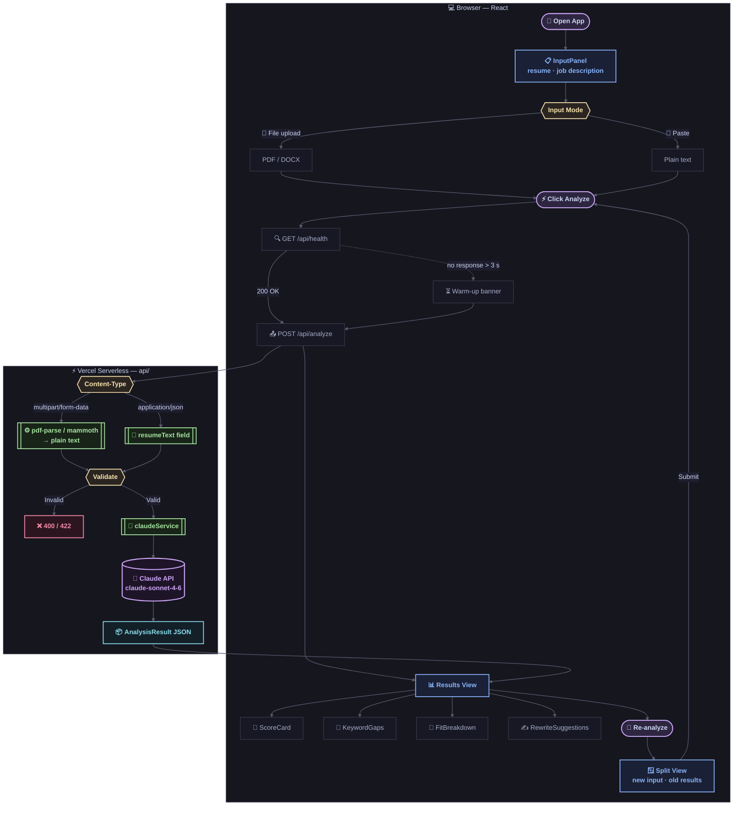

# Resume Analyzer

A full-stack web app that analyzes your resume against a job description and returns:

- **ATS compatibility score** (0–100) with an honest verdict
- **Keyword gap analysis** — missing keywords grouped by importance
- **Section-by-section fit breakdown** with actionable feedback
- **Tailored rewrite suggestions** for your weakest bullet points

Built with React + TypeScript on the frontend and Vercel Serverless Functions on the backend, powered by the Claude API.

**Live:** https://ai-resume-analyzer-amt.vercel.app

---

## Application Flow


---

## Stack

| Layer | Technology |
|---|---|
| Frontend | React 18, TypeScript, Vite, Tailwind CSS |
| Backend | Vercel Serverless Functions (Node.js, TypeScript) |
| LLM | Anthropic Claude API (`claude-sonnet-4-6`) |
| PDF parsing | `pdf-parse` |
| DOCX parsing | `mammoth` |
| Deployment | Vercel (frontend + API, single project) |

---

## Features

- **ATS score + verdict** — scored 0–100 with a plain-English summary
- **Keyword gap analysis** — missing keywords ranked by critical / important / nice-to-have
- **Section fit breakdown** — per-section score and targeted feedback
- **Rewrite suggestions** — specific before/after rewrites for your weakest bullets
- **Re-analyze split-view** — edit and re-submit without losing your previous results; Claude avoids repeating previous suggestions
- **File or paste input** — upload PDF/DOCX or paste plain text
- **Dark / light theme** — persisted to localStorage
- **Mobile responsive** — works on phone and desktop
- **Rate limiting** — 2 analyses per IP per 30 minutes
- **Input quality detection** — warns when resume text is too short or garbled to be reliable

---

## Running Locally

### Prerequisites

- Node.js 18+
- An [Anthropic API key](https://console.anthropic.com/)

### 1. Clone and install

```bash
git clone <your-repo-url>
cd resume-analyzer
npm install

# Install client dependencies
cd client && npm install && cd ..

# Install server dependencies (used for local dev only)
cd server && npm install && cd ..
```

### 2. Configure environment variables

**Root** — create `.env` (picked up by the local server):
```
ANTHROPIC_API_KEY=your_key_here
PORT=3001
```

**Client** — create `client/.env.local`:
```
VITE_API_URL=http://localhost:3001
```

### 3. Start both servers

```bash
# Terminal 1 — backend (runs on :3001)
cd server && npm run dev

# Terminal 2 — frontend (runs on :5173)
cd client && npm run dev
```

Open [http://localhost:5173](http://localhost:5173).

---

## Input Modes

- **Upload a file** — PDF or DOCX (5 MB max). Complex multi-column layouts may reduce accuracy; paste mode is more reliable for those.
- **Paste text** — plain text, minimum 200 characters.

---

## Deployment

The project is a single Vercel deployment. The `client/` builds to a static site; the `api/` directory is served as Vercel Serverless Functions.

### Steps

1. Push this repo to GitHub.
2. Go to [Vercel](https://vercel.com) → New Project → Import from GitHub.
3. Leave the root directory as `/` (the `vercel.json` at the root configures everything).
4. Add one environment variable: `ANTHROPIC_API_KEY=your_key_here`.
5. Deploy. Vercel builds the frontend and wires up the API functions automatically.

### What `vercel.json` configures

| Setting | Value |
|---|---|
| Build command | `cd client && npm install && npm run build` |
| Output directory | `client/dist` |
| `/api/analyze` max duration | 60 s |
| `/api/health` max duration | 10 s |
